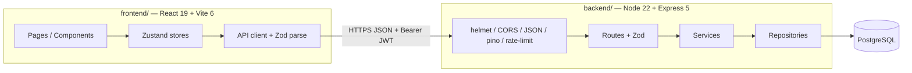
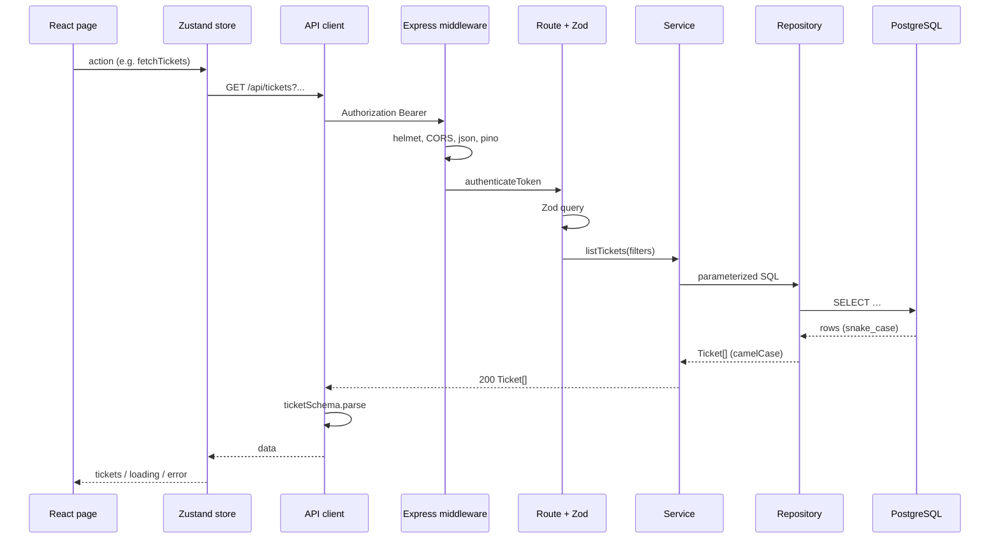
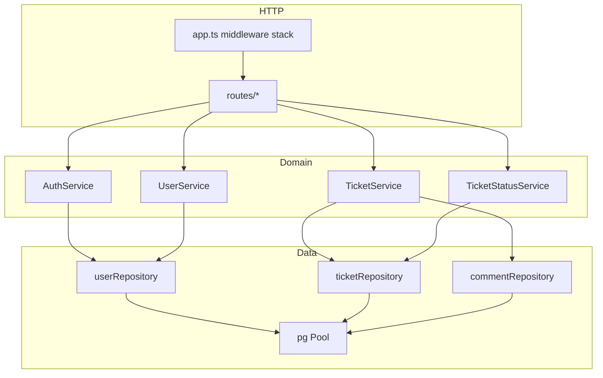
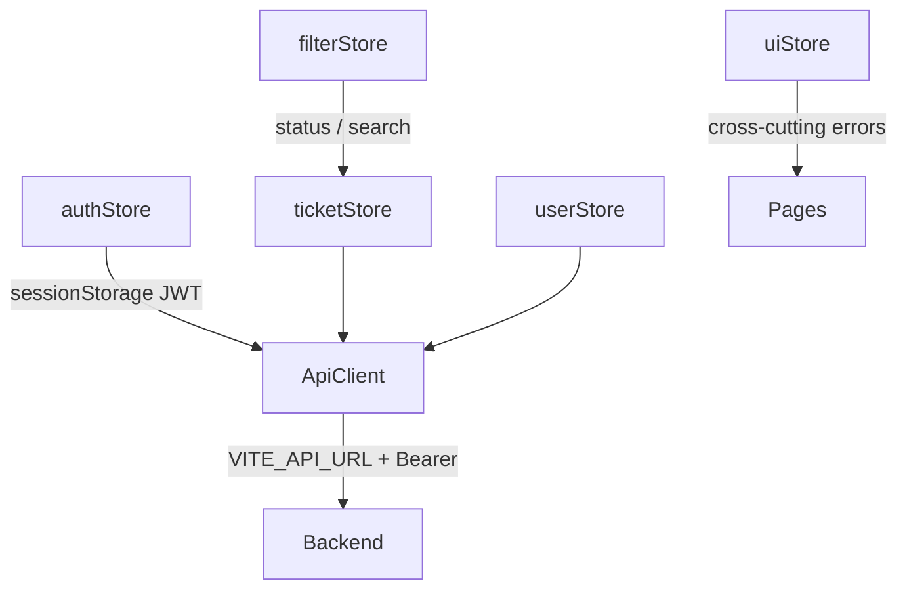
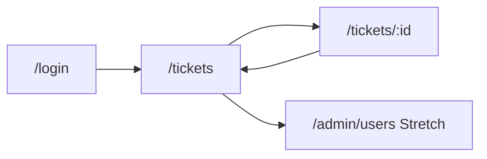
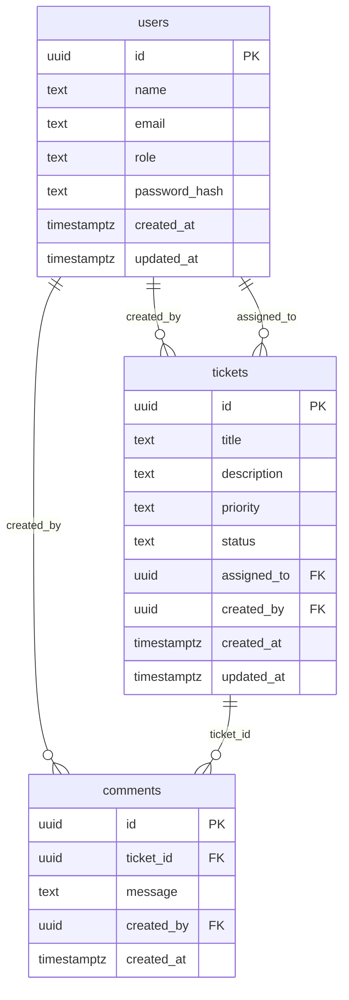
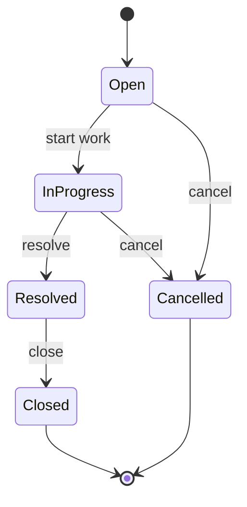
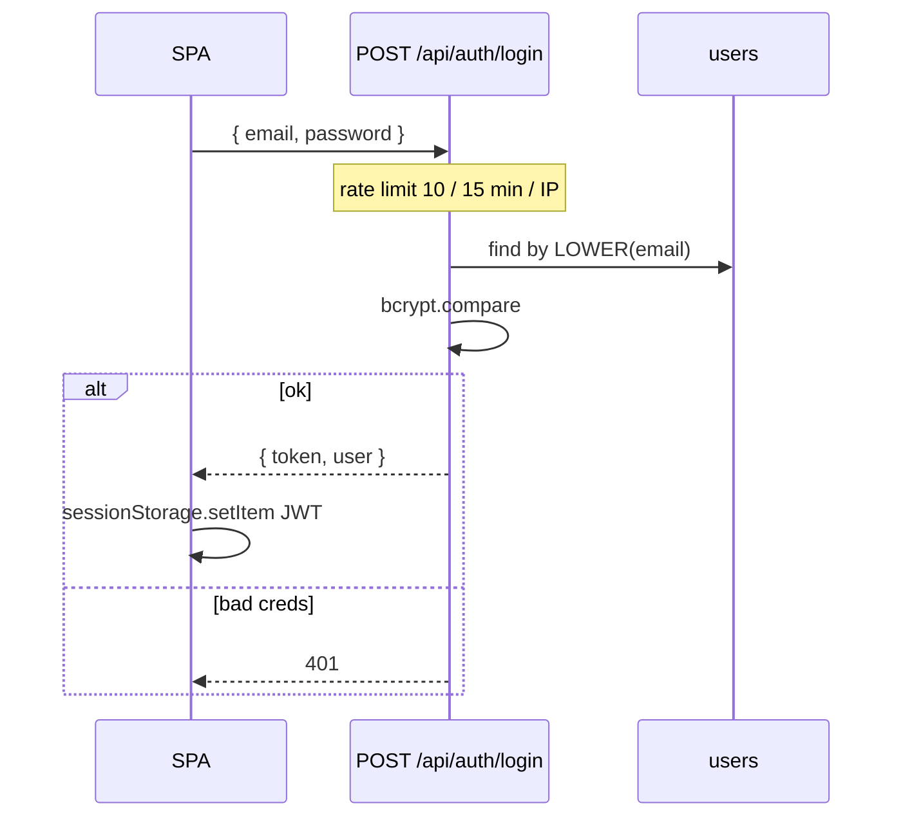

# Design Notes — Support Ticket Management System

Design decisions for the Backend-Heavy AI Capability Exercise project.

**Standards:** Implementation must follow `.cursor/rules/` — especially `coding-standards.mdc`, `nodejs-backend-patterns.mdc`, `database-standards.mdc`, `typescript-strict.mdc`, `react19-standards.mdc`, and `tailwind-standards.mdc`.  
**Product scope:** `docs/raw-requirements.md` + `tool-specific/cursor-workflow/spec.md`.

---

## 1. High-level architecture

Two packages talk over JSON HTTP. The SPA never touches PostgreSQL; the API never renders HTML.



### Request path (authenticated ticket op)



### Key cross-cutting choices

| Decision | Choice | Why |
|----------|--------|-----|
| API style | Bare resources on success; `{ error, code, details? }` on failure | Matches `typescript-strict.mdc` / backend rules — no `{ success }` envelope |
| ORM | None — `pg` pool + repositories | Explicit SQL, simpler exercise ownership, rule mandate |
| Validation | Zod at route boundary (+ DB CHECKs) | Dual control; types via `z.infer` |
| Shared types | Duplicate identical Zod schemas in FE & BE | Avoid premature monorepo package; fix drift immediately |
| Search | `pg_trgm` + `ILIKE` | Rule-chosen approach for Core keyword search |

---

## 2. Backend layered architecture

Per `coding-standards.mdc` / `nodejs-backend-patterns.mdc`: **routes → services → repositories**. Never skip a layer; never query the DB from a route.



### Layer responsibilities

| Layer | Owns | Must not |
|-------|------|----------|
| **Route** | HTTP status, Zod parse of body/query/params, call service | Business branching on status; raw SQL |
| **Service** | Use-cases; `TicketStatusService` owns the entire state machine | Know Express `req`/`res` details beyond DTOs |
| **Repository** | Parameterized SQL, row → DTO mapping, PG error translation | Status state machine, JWT, HTTP codes |
| **Middleware** | AuthN/Z, security headers, CORS, logging, rate limit, global errors | Business branching on ticket status |

### Middleware order (`nodejs-backend-patterns.mdc`)

1. `helmet()`  
2. `cors({ origin: FRONTEND_ORIGIN, …, credentials: false })`  
3. `express.json({ limit: '100kb' })`  
4. pino-http (or equivalent)  
5. Routes  
6. 404 → `{ error, code: 'NOT_FOUND' }`  
7. Global error handler → 500 `INTERNAL_ERROR` (no stacks/SQL in client body)

Env is Zod-validated **before** listen: `DATABASE_URL`, `JWT_SECRET` (≥32), `FRONTEND_ORIGIN`, `PORT`, `NODE_ENV`.

### Crypto split

- **bcrypt** (async, cost **12**) — password hash/verify only  
- **`node:crypto`** — UUIDs / non-password randomness  
- Never hash passwords with `node:crypto`; never log tokens/secrets  

---

## 3. Frontend design (React 19, Zustand, Tailwind)

Aligned with `react19-standards.mdc`, `tailwind-standards.mdc`, `typescript-strict.mdc`.

### Principles

1. **Zustand is the primary data layer** — five stores hold server data, loading/error, and async API actions.  
2. **Server owns business rules** — UI only filters which status buttons to show via a read-only `TRANSITIONS` map.  
3. **Store-driven loading** — `useEffect` triggers store fetches; do not mix Suspense/`use(Promise)` as a second source of truth for the same list.  
4. **React 19 forms** — `useActionState` for login & create ticket; `useOptimistic` + rollback for comments & status (especially on **409**).  
5. **Tailwind CSS 4** — exactly one CSS entry (`src/index.css` with `@import "tailwindcss"`); utilities only; no `@apply` for components; no inline `style={{}}`; no Core dark mode.

### Store map



| Store | Holds | Notes |
|-------|-------|-------|
| `authStore` | user, token, hydrate/login/logout | JWT in `sessionStorage`; 401 → clear + `/login` |
| `ticketStore` | tickets, current ticket, async CRUD/status/comments | Committed source of truth after server responds |
| `userStore` | users for assignee picker (+ admin CRUD Stretch) | Never expects password fields |
| `filterStore` | search, status (+ Stretch filters) | Drives list refetch |
| `uiStore` | optional global toasts / shared UI error | Keep form pending in `useActionState` when that form owns submit |

### Routing UX



- `ProtectedRoute` redirects unauthenticated users to `/login`.  
- Admin nav/routes **hidden** (not merely disabled) unless `role === 'admin'`; wait for auth hydration.  
- Status/priority badges use centralized maps from `tailwind-standards.mdc` (`STATUS_STYLES`, etc.).  
- Error boundaries around route-level pages; accessible labels, focus rings, `role="alert"` / `aria-live` for errors.

---

## 4. Database design & schema

Per `database-standards.mdc`: three Core tables, UUID PKs (`pgcrypto`), `timestamptz`, CHECK constraints, repositories map snake_case ↔ camelCase and **never** return `password_hash`.



### Constraints & indexes (summary)

| Concern | Design |
|---------|--------|
| Roles | CHECK `agent` \| `admin` |
| Priority | CHECK `low` \| `medium` \| `high` |
| Status | CHECK `Open` \| `In Progress` \| `Resolved` \| `Closed` \| `Cancelled`; default `Open` |
| Lengths | title ≤200, description ≤5000, message ≤2000, name ≤100 |
| Email uniqueness | `UNIQUE INDEX` on `LOWER(email)` |
| FKs | `assigned_to` ON DELETE SET NULL; `created_by` / comment author ON DELETE RESTRICT; comments ON DELETE CASCADE with ticket |
| Search | Extension `pg_trgm`; GIN on `title` / `description`; query via parameterized `ILIKE` |
| Migrations | Apply-once in `backend/migrations/` (`001`…`005`); prefer this over top-level `database/` for runtime |

### Seed

Idempotent runtime bcrypt (cost 12):

- `admin@example.com` / `Admin123!` → `admin`  
- `agent@example.com` / `Agent123!` → `agent`  

Credentials documented in README only — not in code comments or committed hash SQL.

### Pool

`max: 20` (dev), `statement_timeout: '30s'`; production SSL `rejectUnauthorized: true`; graceful `pool.end()` on shutdown.

---

## 5. State machine design

Signature Core feature (`docs/raw-requirements.md`, `spec.md` §4). **Authoritative enforcement is server-side** in `TicketStatusService`.



| From | Allowed next |
|------|----------------|
| Open | In Progress, Cancelled |
| In Progress | Resolved, Cancelled |
| Resolved | Closed |
| Closed | _(none)_ |
| Cancelled | _(none)_ |

### Enforcement rules

1. Only `TicketStatusService.transition(ticketId, toStatus)` mutates status.  
2. Run inside a transaction with `SELECT … FOR UPDATE` so concurrent PATCHes cannot both apply.  
3. Illegal transition → **409** `INVALID_TRANSITION`; row status unchanged.  
4. `PATCH /api/tickets/:id` **rejects** body `status` with **400** (field updates only).  
5. UI shows buttons only for allowed next states; on 409, inline error + `useOptimistic` rollback — no full reload.  
6. Integration tests (Vitest + supertest) must exercise real service — **do not mock** `TicketStatusService`.

```mermaid
sequenceDiagram
  participant C as Client
  participant R as PATCH .../status
  participant S as TicketStatusService
  participant DB as PostgreSQL

  C->>R: { status: "Resolved" }
  R->>S: transition(id, "Resolved")
  S->>DB: BEGIN; SELECT … FOR UPDATE
  alt valid edge
    S->>DB: UPDATE status; COMMIT
    S-->>C: 200 Ticket
  else invalid edge
    S->>DB: ROLLBACK
    S-->>C: 409 INVALID_TRANSITION
  end
```

---

## 6. Auth & RBAC design

Auth is **in scope for this repo** even though the exercise lists it under Stretch (`coding-standards.mdc`).

### Model

| Mechanism | Detail |
|-----------|--------|
| Credentials | Email + password; bcrypt compare |
| Token | JWT Bearer, 24h, claims `{ sub, email, role, iat, exp }` |
| Storage (SPA) | `sessionStorage` via `authStore` |
| Middleware | `authenticateToken` then optional `requireRole('admin')` |
| Login abuse | `express-rate-limit` **10 / 15 min / IP** (all attempts) → 429 `RATE_LIMITED` |
| CORS | Allowlist = `FRONTEND_ORIGIN` only; `credentials: false` |

### Role matrix

| Capability | agent | admin | anonymous |
|------------|:----:|:-----:|:---------:|
| `GET /api/health`, `POST /api/auth/login` | ✓ | ✓ | ✓ |
| Tickets CRUD-ish, comments, search, status | ✓ | ✓ | ✗ |
| `GET /api/users` (assignee list) | ✓ | ✓ | ✗ |
| User write CRUD (Stretch) | ✗ | ✓ | ✗ |

**Authorization model:** any authenticated agent/admin may read/update **any** ticket (internal tool — not per-ticket ACL).



### Trade-off note

| Choice | Alternative considered | Rationale |
|--------|------------------------|-----------|
| JWT in `sessionStorage` | httpOnly cookie session | Fits Bearer API + SPA exercise; XSS mitigated by plain-text fields + no `dangerouslySetInnerHTML` |
| Internal open ticket ACL | Per-assignee only | Matches “small internal tool” scope; simpler Core |

---

## 7. Folder structure explanation

### Repository layout

```
ai-powered-ticket-mg-system/
├── backend/                 # API + migrations + tests
├── frontend/                # SPA
├── docs/                    # raw-requirements, design-notes, …
├── tool-specific/
│   └── cursor-workflow/     # project-context, spec, tasks, …
├── .cursor/rules/           # generation & coding guardrails
├── .github/workflows/       # CI (Stretch)
├── database/                # optional SQL notes; prefer backend/migrations for runtime
├── ai-prompts/              # optional reusable prompts
├── tool-workflow.md         # Part A
└── README.md
```

### `backend/` (why each folder)

```
backend/
├── migrations/           # 001…005 SQL — apply-once source of truth
├── src/
│   ├── index.ts          # boot, listen, graceful shutdown
│   ├── app.ts            # Express app export for supertest
│   ├── config/           # env Zod schema
│   ├── db/               # pool, migrate runner
│   ├── middleware/       # auth, errors, rate limit
│   ├── routes/           # HTTP + Zod only
│   ├── services/         # business logic; TicketStatusService
│   ├── repositories/     # pg SQL + mappers
│   ├── schemas/          # Zod domain + request schemas
│   └── __tests__/        # and/or *.test.ts colocated
└── package.json
```

Separation keeps HTTP, domain, and SQL testable in isolation and matches rule layering.

### `frontend/` (why each folder)

```
frontend/
├── src/
│   ├── main.tsx
│   ├── index.css         # ONLY custom CSS — Tailwind v4 entry
│   ├── app/              # router, layout, ProtectedRoute
│   ├── pages/            # Login, TicketList, TicketDetail, AdminUsers
│   ├── components/       # named exports; one non-trivial component per file
│   ├── stores/           # five Zustand stores
│   ├── api/              # fetch wrapper, auth header, Zod parse
│   ├── schemas/          # Zod mirrors of backend domain
│   └── lib/              # TRANSITIONS, STATUS_STYLES helpers
└── package.json
```

Zustand stores are the data layer (`react19-standards.mdc`); pages stay thin; Tailwind stays utility-first with a single CSS entry (`tailwind-standards.mdc`); duplicated Zod schemas stay manually synced (`typescript-strict.mdc`) until a shared package is an explicit decision.

---

## 8. Design checklist (before calling Core “done”)

- [ ] Layers respected (no route → SQL shortcuts)  
- [ ] Status only via `TicketStatusService` + `FOR UPDATE`  
- [ ] Zod at every route; FE/BE domain schemas match  
- [ ] Repositories map snake ↔ camel and omit `password_hash`  
- [ ] JWT auth + RBAC wired; admin UI hidden for agents  
- [ ] Env, helmet, CORS, login rate limit, pino, graceful shutdown present  
- [ ] State-machine integration tests green (Vitest + supertest)  
- [ ] UI loading/error/409 paths work; Tailwind maps centralized  

---

*Update this document when a design decision changes; keep it consistent with `.cursor/rules/` and `spec.md`.*
